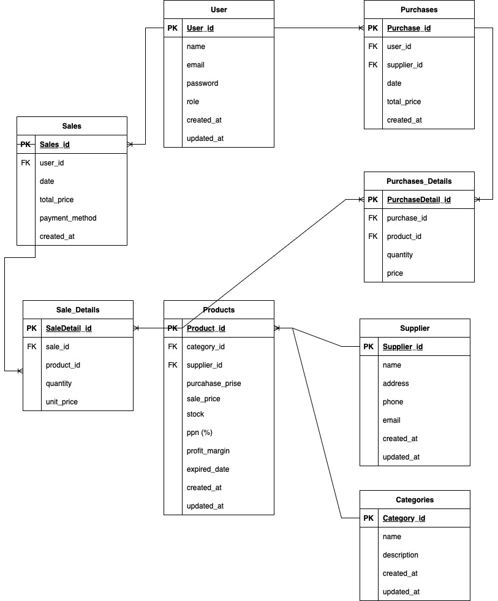

# Laporan Progres Mingguan - PharmaSys

**Kelompok**: 1  
**Mitra**: Tiarana Farma  
**Pekan**: 10  
**Tanggal**: 11/04/2025  

---

## ✅ Tujuan Minggu Ini
Mengerjakan tahap awal sistem informasi apotek PharmaSys yang mencakup:
- Perancangan ERD (Entity Relationship Diagram)
- Pembuatan Backend Skeleton (minimal 2 endpoint aktif)
- Pembuatan Frontend Skeleton menggunakan React (routing dasar)

---

## 🧩 1. Entity Relationship Diagram (ERD)

Telah dibuat ERD yang menggambarkan hubungan antar entitas penting dalam sistem, meliputi:  
- **Users**  
- **Products**  
- **Categories**  
- **Suppliers**  
- **Sales**  
- **Purchases**
- **Sales_Deatails**  
- **Purchases_Details**




---


## ⚙️ 2. Backend Skeleton

### Framework: Laravel

### Endpoint yang telah dibuat
| Method | Endpoint                  | Deskripsi                      |
|--------|---------------------------|--------------------------------|
| GET    | `/admin/products`         | Menampilkan daftar produk      |
| POST   | `/admin/products`         | Menambah produk                |
| GET    | `/admin/sales`            | Menampilkan daftar penjualan   |
| POST   | `/admin/sales`            | Menambahkan transaksi penjualan |

Endpoint dapat diakses melalui web route (`web.php`)

---

## 🎨 3. Frontend Skeleton

### Framework: React

### Halaman dan Routing:
- `/dashboard` → Menampilkan halaman dashboard kosong
- `/products` → Menampilkan halaman produk kosong

Contoh struktur routing dasar:
```jsx
import { BrowserRouter, Routes, Route } from 'react-router-dom';
import Dashboard from './pages/Dashboard';
import Products from './pages/Products';

function App() {
  return (
    <BrowserRouter>
      <Routes>
        <Route path="/dashboard" element={<Dashboard />} />
        <Route path="/products" element={<Products />} />
      </Routes>
    </BrowserRouter>
  );
}
```

> Tampilan UI masih berupa halaman kosong dan akan dikembangkan lebih lanjut pada minggu berikutnya.

---

## 📌 Rencana Minggu Depan
- Melengkapi fitur CRUD pada frontend
- Menambahkan validasi form dan integrasi ke API
- Penyempurnaan tampilan UI dan dashboard

