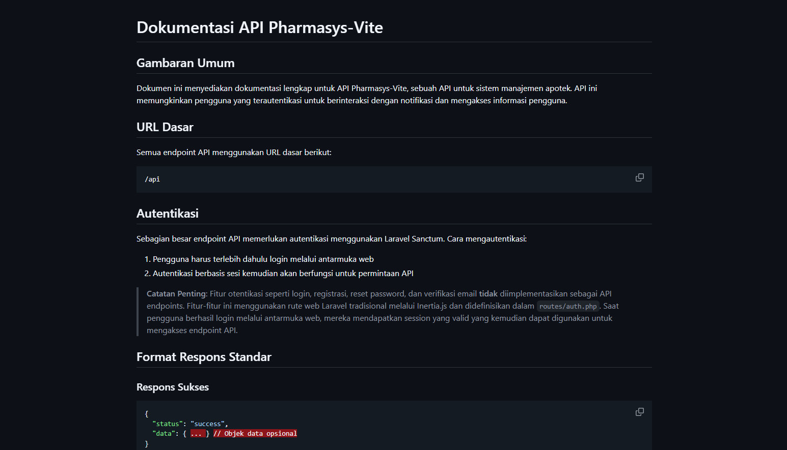

# Laporan Progres Mingguan - Pharmasys

**Kelompok**: 1

**Nama anggota kelompok:**
- Adam Ibnu Ramadhan (10231003)
- Muhammad Bagas Setiawan (10231061)
- Putu Ngurah Semara (10231075)
- Raisha Alika Irwandira (10231077)
- Rendy Rifandi Kurnia (10231081)

**Mitra**: Tiarana Farma

**Pekan ke-**: 15

**Tanggal**: 22/05/2025

## Progress Summary

## Accomplished Tasks
 ### 1. Memperbarui README yang ada di Github menjadi lebih lengkap dari segi daftar fitur, tutorial pemasangan, dan struktur sistem
 
 ### 2. Pembuatan API Docs 

## Challenges & Solutions
- **Challenge 1**: Kurangnya partisipasi anggota lain dalam pengerjaan proyek
- **Solution**: Mengerjakan sebisa mungkin dengan sumber daya manusia yang ada untuk menyelesaikan projek.

## Next Week Plan

## Contributions
- **Adam Ibnu Ramadhan**: Membuat PPT presentasi
- **Muhammad Bagas Setiawan**:  Mengerjakan pembuatan sistem dari awal hingga akhir
- **Putu Ngurah Semara**: Menulis README, melakukan tes pada sistem, dan membuat laporan mingguan 
- **Raisha Alika Irwandira**:  Menghubungi mitra
- **Rendy Rifandi Kurnia**: Menghubungi mitra
