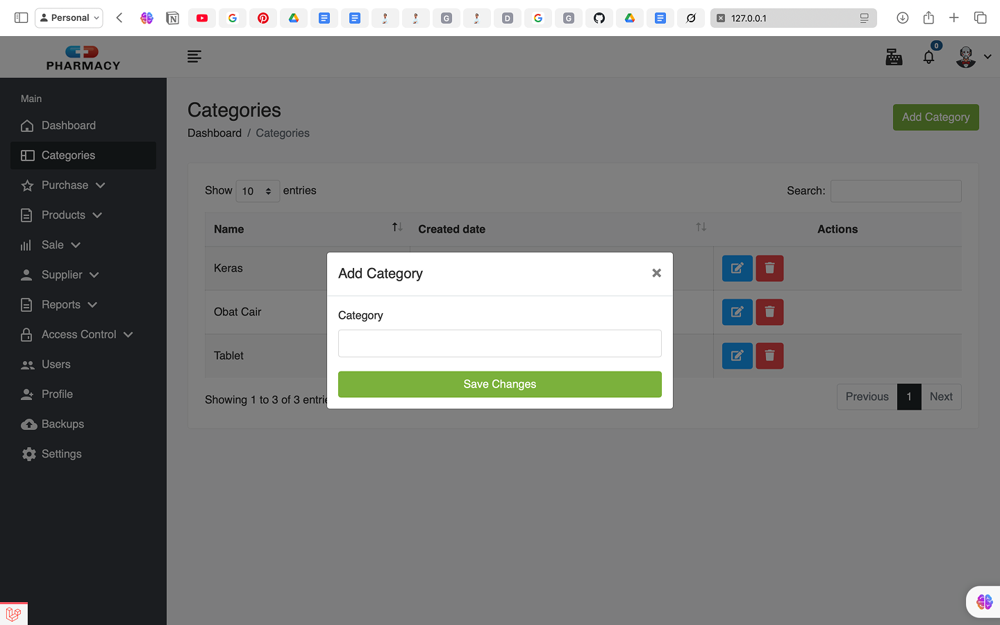
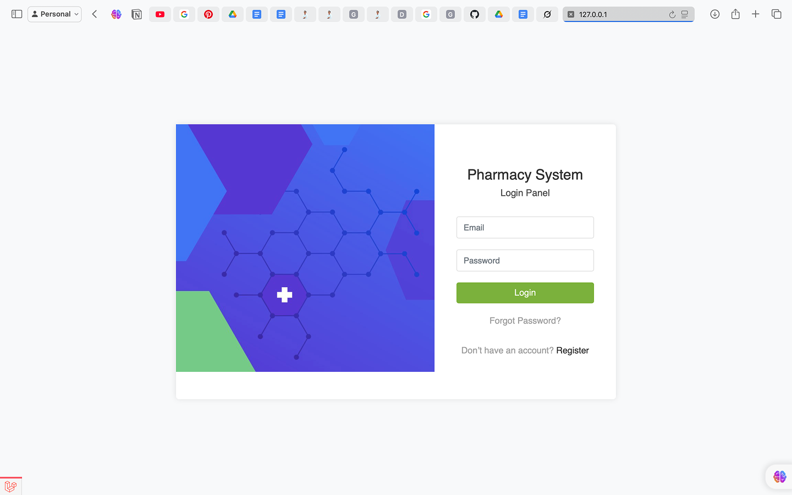

# Laporan Progres Mingguan - Pharmasys

**Kelompok**: 1

**Nama anggota kelompok:**
- Adam Ibnu Ramadhan (10231003)
- Muhammad Bagas Setiawan (10231061)
- Putu Ngurah Semara (10231075)
- Raisha Alika Irwandira (10231077)
- Rendy Rifandi Kurnia (10231081)

**Mitra**: Tiarana Farma

**Pekan ke-**: 12

**Tanggal**: 1/05/2025

## Progress Summary


## Accomplished Tasks

---

- ### Membuat Auth system
Pada minggu ini kami berhasil membuat sistem login untuk aplikasi kami yaitu pharmasys yang mana ini berfungsi untuk membedakan peran dari pengguna yang akan menggunakan sistem. Terdapat dua role pengguna dalam aplikasi ini pertama sebagai admin yaitu yang mengatur semua produk, melihat data keuangan, dan lain lain. Kedua ada kasir yang berperan untuk melayani kustomer dan mengakses produk apa saja yang dijual.

---

- ### Membuat fitur Create produk untuk admin 
Seperti yang sudah dijelaskan di atas bahwa admin bisa menambahkan produk untuk dijual dimana fitur ini adalah yagn dimaksud. Pada fitur ini pengguna yang berperan sebagai admin dapat memasukkan data data barang yang akan dijual seperti nama, deskripsi produk, harga, dan gambar produk. 

``` php
    public function create()
    {
        $title = 'add product';
        $purchases = Purchase::get();
        return view('admin.products.create',compact(
            'title','purchases'
        ));
        
    }
```
---


- ### Membuat fitur Update produk untuk admin
Fitur ini merupakan terusan dari fitur sebelumnya dimana pada fitur pengguna yang berperan sebagai admin dapat mengedit produk seperti nama, deskripsi produk, harga, dan gambar produk. 

``` php
public function edit(Product $product)
    {
        $title = 'edit product';
        $purchases = Purchase::get();
        return view('admin.products.edit',compact(
            'title','product','purchases'
        ));
    }

     @param  \Illuminate\Http\Request  $request
     @param  \app\Models\Product $product
     @return \Illuminate\Http\Response
     
    public function update(Request $request, Product $product)
    {
        $this->validate($request,[
            'product'=>'required|max:200',
            'price'=>'required',
            'discount'=>'nullable',
            'description'=>'nullable|max:255',
        ]);
        
        $price = $request->price;
        if($request->discount >0){
           $price = $request->discount * $request->price;
        }
       $product->update([
            'purchase_id'=>$request->product,
            'price'=>$price,
            'discount'=>$request->discount,
            'description'=>$request->description,
        ]);
        $notification = notify('product has been updated');
        return redirect()->route('products.index')->with($notification);}
```

---

## Challenges & Solutions
- **Challenge 1**: Sempat mengalami error pada koneksi DB dimana tidak masuk saat menambahkan
  - **Solution**: Debugging menggunakan AI untuk mendeteksi kesalahan dan memperbaiki error.

## Next Week Plan
- Melkukan unit test
- Membuat beberapa fitur utama
- Melakukan perbaikan UI

## Contributions
- **Adam Ibnu Ramadhan**: Membuat create
- **Muhammad Bagas Setiawan**: Membuat auth 
- **Putu Ngurah Semara**: Membuat create
- **Raisha Alika Irwandira**: Membuat update 
- **Rendy Rifandi Kurnia**: Membuat update

## Screenshoot
### Create

### Login
