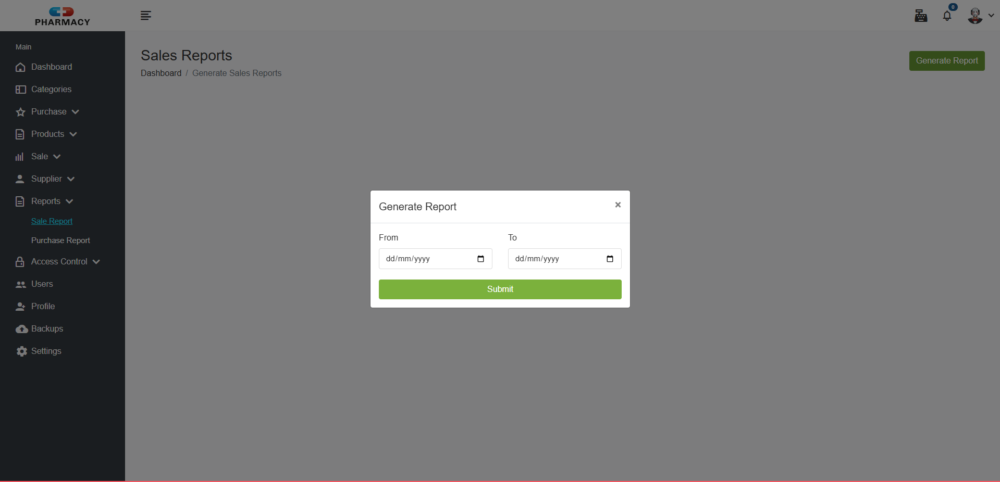
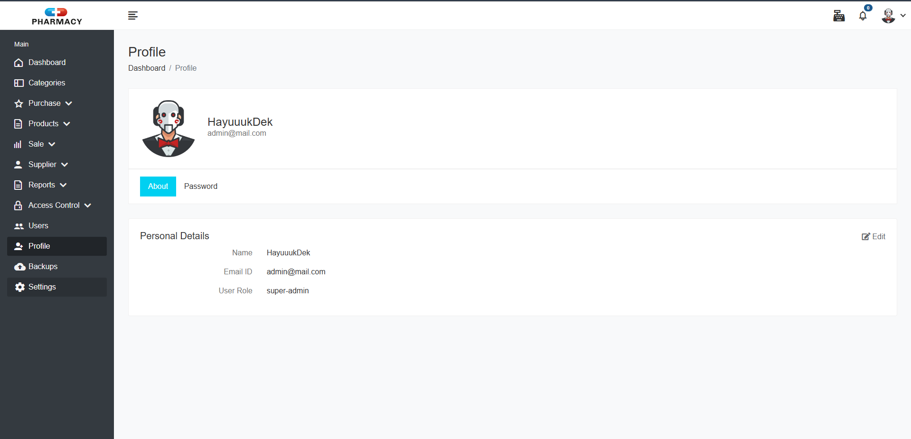

# Laporan Progres Mingguan - Pharmasys

**Kelompok**: 1

**Nama anggota kelompok:**
- Adam Ibnu Ramadhan (10231003)
- Muhammad Bagas Setiawan (10231061)
- Putu Ngurah Semara (10231075)
- Raisha Alika Irwandira (10231077)
- Rendy Rifandi Kurnia (10231081)

**Mitra**: Tiarana Farma

**Pekan ke-**: 12

**Tanggal**: 1/05/2025

## Progress Summary

## Accomplished Tasks

---

- ### Menyelesaikan Fitur Pada Role Kasir

    Pada minggu ini kami berhasil menyelesaikan fitur untuk role kasir sehingga pada akun kasir dapat melakukan penjualan. Fitur ini meliputi memilih produk yang dipilih pelanggan dan menambahkan dalam keranjang yang kemudian akan ditotal untuk menampilkan harga yang harus dibayarkan pelanggan; Tampilan dashboard yang menunjukkan pie chart dari penjualan, List produk yang baru baru terjual, dan jumlah produk yang expired; Akun kasir juga bisa melakukan perubahan pada foto profilenya untuk menyesuaikan dengan kemauannya. 
---

- ### Menambahkan Fitur Yang Ada Pada Role Admin 
     Sebelumnya pada role admin hanya bisa melakukan CRUD produk obat namun sekarang kami menambahkan fitur seperti supplier untuk menentukan obat yang akan di restock, Report untuk menampilkan laporan penghasilan selama kurun waktu tertentu, access controll untuk mengubah akses dari suatu akun kasir agar dapat menggunakan fitur lain yang ada, User dimana admin dapat menghapus akun akun yang ada, Profile dimana admin bisa mengubah foto profilenya, dan Setting untuk mengatur tampilan aplikasi

---

- ### Memperbaiki Fitur Yang Ada Pada Role Admin 
     Sebelumnya pada role admin terdapat fitur fitur yang baru ditambahkan dan mengalami error saat kami melakukan demo dengan stakeholder seperti fitur supplier yang tidak terhubung dengan database, dan lain lain

---

- ### Melakukan Testing Dengan Mitra
  Minggu ini kami melakukan testing bersama dengan mitra dimana sempat terjadi error pada fitur yang belum kami selesaikan. Dari pihak mitra meminta untuk menambahkan beberapa perubahan pada beberapa fitur yang mana dirasa kurang sesuai dengan yang dibutuhkan

---

## Challenges & Solutions
- **Challenge 1**: Kurangnya partisipasi anggota lain dalam pengerjaan proyek
  - **Solution**: Mengerjakan sebisa mungkin dengan sumber daya manusia yang ada untuk menyelesaikan projek.

## Next Week Plan
- Memperbaiki fitur yang sudah ada
- Melakukan perbaikan UI
- Melakukan Unit Test
- Melakukan pengujuian dengan mitra

## Contributions
- **Adam Ibnu Ramadhan**: 
- **Muhammad Bagas Setiawan**:  
- **Putu Ngurah Semara**: 
- **Raisha Alika Irwandira**:  
- **Rendy Rifandi Kurnia**: 

## Screenshoot
### Fitur Supplier

### Fitur Report

### Fitur Access Controll

### Fitur User

### Fitur Profile

### Fitur Setting

### Dokumentasi Bersama Mitra
