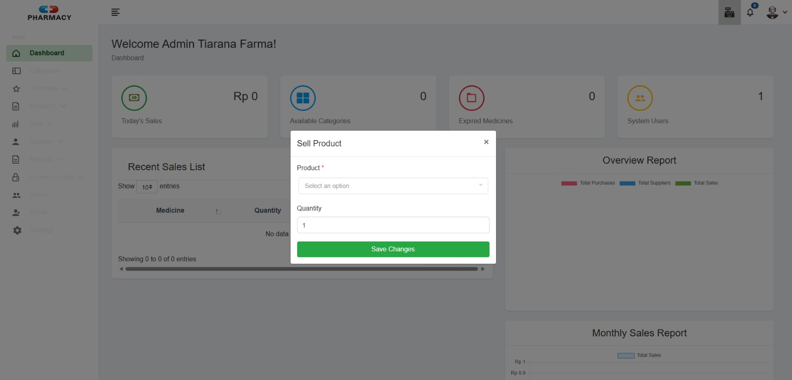

# Laporan Progres Mingguan - Pharmasys

**Kelompok**: 1

**Nama anggota kelompok:**
- Adam Ibnu Ramadhan (10231003)
- Muhammad Bagas Setiawan (10231061)
- Putu Ngurah Semara (10231075)
- Raisha Alika Irwandira (10231077)
- Rendy Rifandi Kurnia (10231081)

**Mitra**: Tiarana Farma

**Pekan ke-**: 13

**Tanggal**: 09/05/2025

## Progress Summary

## Accomplished Tasks

---

- ### Memperbarui Tampilan 

   Pada minggu ini, kami melakukan upaya perbaikan dan penyempurnaan tampilan antarmuka sistem agar terlihat lebih modern dan responsif. Salah satu langkah signifikan yang kami ambil adalah mengganti teknologi pengelolaan aset front-end yang sebelumnya menggunakan Laravel Mix menjadi Laravel Vite. Perubahan ini didasari oleh kebutuhan untuk meningkatkan efisiensi dalam proses pengembangan, mempercepat waktu build, serta memanfaatkan dukungan teknologi modern seperti React, Tailwind CSS, dan TypeScript secara lebih optimal. Laravel Vite menyediakan fitur hot module replacement (HMR) yang memungkinkan perubahan kode terlihat secara langsung tanpa perlu me-refresh halaman, sehingga sangat mempercepat proses iterasi desain dan pengujian antarmuka. Dengan beralih ke Laravel Vite, kami berharap pengalaman pengguna dan performa sistem dapat ditingkatkan secara signifikan, sejalan dengan tujuan kami untuk menghadirkan sistem yang modern, cepat, dan mudah dikembangkan ke depannya.

   gambar pembaruan sistem:
   
   #### a. Login
   [alt text](IMG/login-new.png)
   #### b. Dashboard
   [alt text](IMG/dashboard-new.png)
   #### c. Kategori
   [alt text](IMG/kategori-new.png)
   #### d. Pembelian
   [alt text](IMG/pembelian-new.png)
   #### e. Gudang
   [alt text](IMG/gudang-new.png)
   #### f. Produk
   [alt text](IMG/produk.png)
   #### g. Riwayat Penjualan
   [alt text](IMG/riwayat-penjualan-new.png)
   #### h. Supplier
   [alt text](IMG/supplier-new.png)
   #### i. Laporan Penjualan
   [alt text](IMG/laporan-penjualan-new.png)
   #### j. Laporan Pembelian
   [alt text](IMG/laporan-pembelian-new.png)
   #### k. Hak Akses (pengguna)
   [alt text](IMG/hakaksespengguna-new.png)
   #### l. Hak Akses (peran)
   [alt text](IMG/hakaksesperan-new.png)
   #### m. Hak Akses (izin)
   [alt text](IMG/hakaksesizin-new.png)
   #### n. Pengaturam Profile penguna
   [alt text](IMG/pengaturanprofile-new.png)
   #### o. Pengaturan Aplikasi 
   [alt text](IMG/pengaturanaplikasi-new.png)
---

- ### Melengkapi Fitur Yang Ada Pada Role Admin dan Sales
     
     Pada minggu kemarin hasil dari testing bersama Mitra, ada beberapa hal yang perlu di lengkap dari fitur fitur yang ada yaitu:

     a. Fitur Transaksi Penjualan
     #### sebelum:
    
     *hanya dapat memilih satu obat untuk setiap transaki (tidak dapat memeilih banyak obat dalam setiap transaksi)

     #### sesudah:
    
     *setiap transaksi bisa memilih beberapa obat

     b. Fitur Supplier
     #### sebelum
    
     *Belum ada kolom tanggal faktur, dan tenggat pembayaran

     #### sesudah:
    
     *Sudah ada detail dari setiap faktur yang dibeli seperti tanggal pembelian dan tenggat pembayaran

     c. Penambahan Fitur Laporan Penjualan
    
     sebelumnya hanya dapat melihat laporan pemjualan, dan sekarang menambhakan fitur laporan pembelian obat dari supplier dengan grafik.
---

- ### Melakukan Testing Mandiri
  Kami melakukan testing untuk mengecek performa dan fungsionalitas fitur dan menemukan bebrapa hal yang perlu di perbaiki diantaranya

  #### a. fitur import purchase pembelian dari excel
  #### a. fitur purchase pembelian (masih bug saat penembahan pembelian manual)
  #### a. fitur Obat Kadaluarsa (masih gagal membaca data backend)
  

---

## Challenges & Solutions
- **Challenge 1**: Kurangnya partisipasi anggota lain dalam pengerjaan proyek
  - **Solution**: Mengerjakan sebisa mungkin dengan sumber daya manusia yang ada untuk menyelesaikan projek.

## Next Week Plan
- Menyelesaikan bug dan mengatasinya
- Melakukan pengujian usability ke 3 user
- Melakukan testing akhir ke mitra
