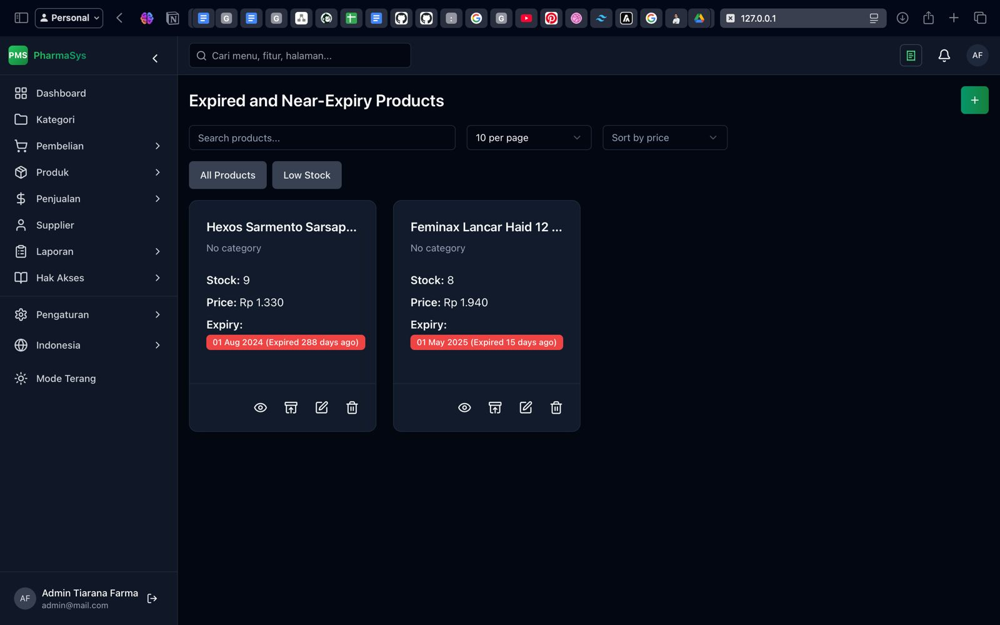
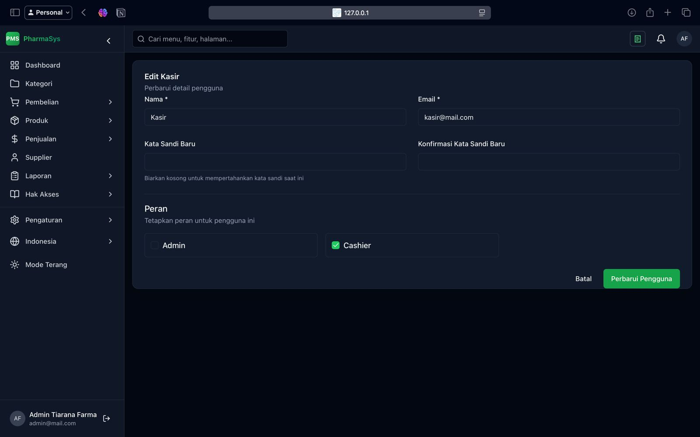

# Laporan Progres Mingguan - Pharmasys

**Kelompok**: 1

**Nama anggota kelompok:**
- Adam Ibnu Ramadhan (10231003)
- Muhammad Bagas Setiawan (10231061)
- Putu Ngurah Semara (10231075)
- Raisha Alika Irwandira (10231077)
- Rendy Rifandi Kurnia (10231081)

**Mitra**: Tiarana Farma

**Pekan ke-**: 14

**Tanggal**: 16/05/2025

## Progress Summary

## Accomplished Tasks
 ### 1. Daftar bug yang ditemukan dan penyelesaiannya 

  - fitur import purchase pembelian dari excel
  

  - fitur purchase pembelian (masih bug saat penembahan pembelian manual)
  

  - fitur Obat Kadaluarsa (masih gagal membaca data backend)
  

 ### 2. Hasil testing mandiri
 Dilakukan pengujian aplikasi secara mandiri dikarenakan dari pihak mitra belum dapat menemukan waktu yang tepat untuk membuat janji temu karena kesibukan mitra.
#### 1. Login 
Memungkinkan pengguna mengakses akun terdaftar

#### 2. Melihat Dashboard 
Menampilkan ringkasan data bisnis dan statistik penjualan

#### 3. Menambah Pembelian Produk
Mencatat transaksi pembelian produk dari supplier

#### 4. Menambah Transaksi Penjualan
Mencatat penjualan produk ke pelangga

#### 5. Menambah Supplier
Menambahkan data supplier ke sistem

#### 6. Melihat Laporan Penjualan
Melihat laporan penjualan berdasarkan periode

#### 7.  Melihat Laporan Pembelian
Melihat laporan pembelian berdasarkan periode

#### 8. Menambah Akun Pengguna Lain
Menambahkan user baru ke sistem

#### 9.  Menambah Peran dalam Sistem
Menambahkan role baru

#### 10.  Melihat Daftar Izin Pengguna
Melihat hak akses dari tiap user

#### 11. Logout
Mengakhiri sesi pengguna

### 3. Deployment Plan 
Dalam pengaplikasian aplikasi Pharmasys, pihak mitra tidak  membutuhkan aplikasi untuk di Deploy karena aplikasi ini di jalankan di internal mitra saja tanpa menggunakan Hosting, Domain dll.

